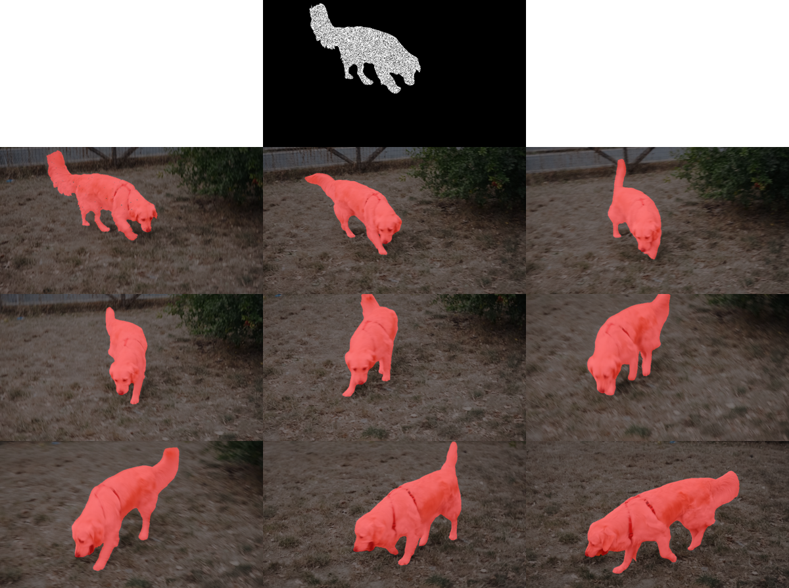
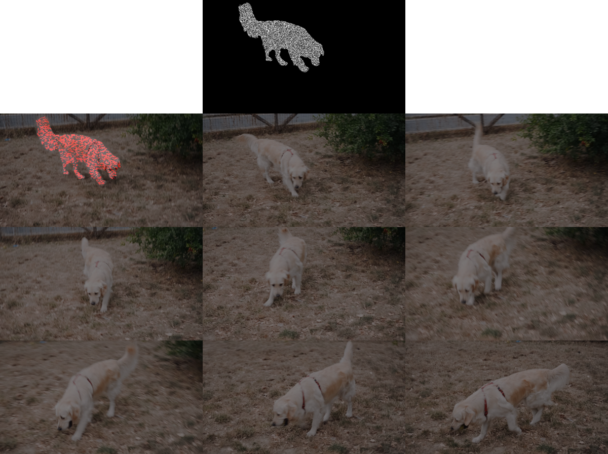
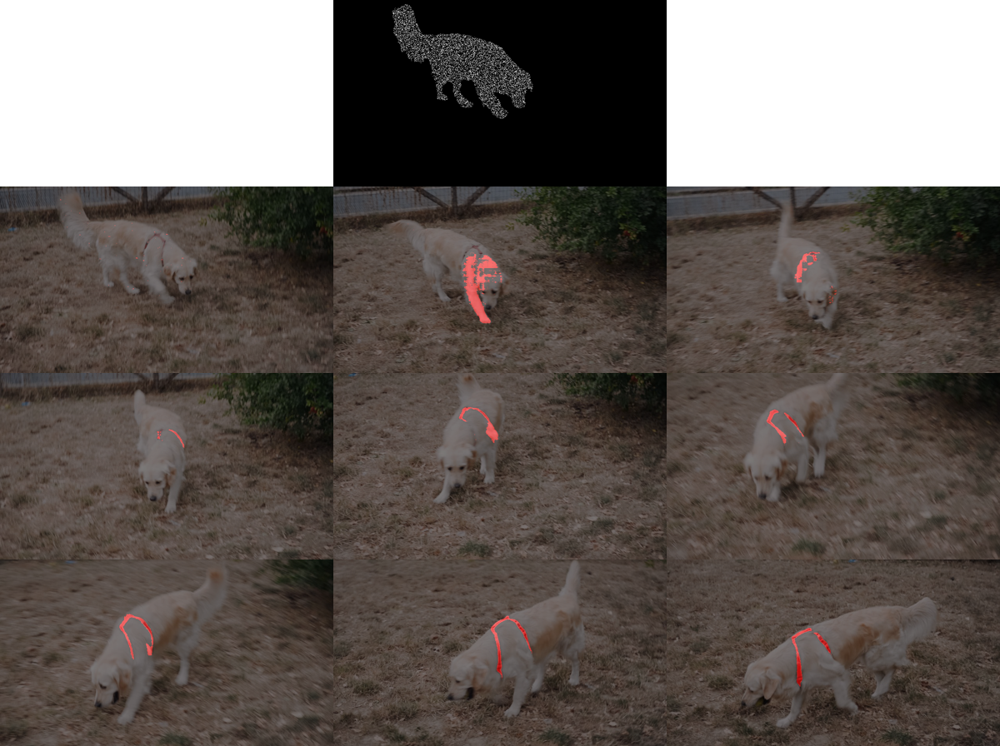
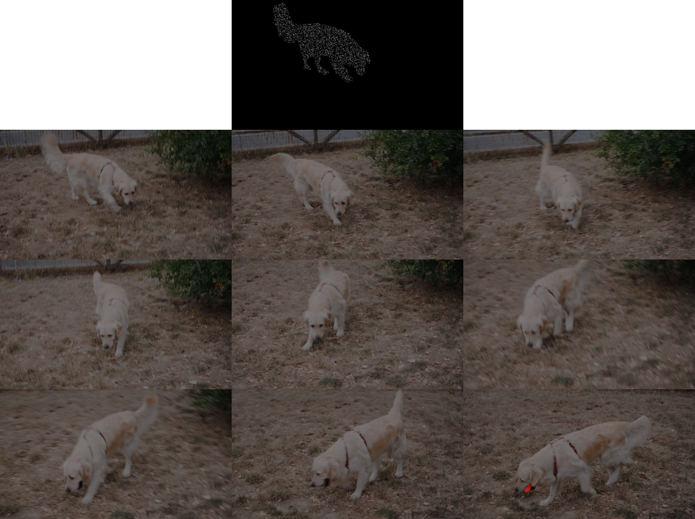
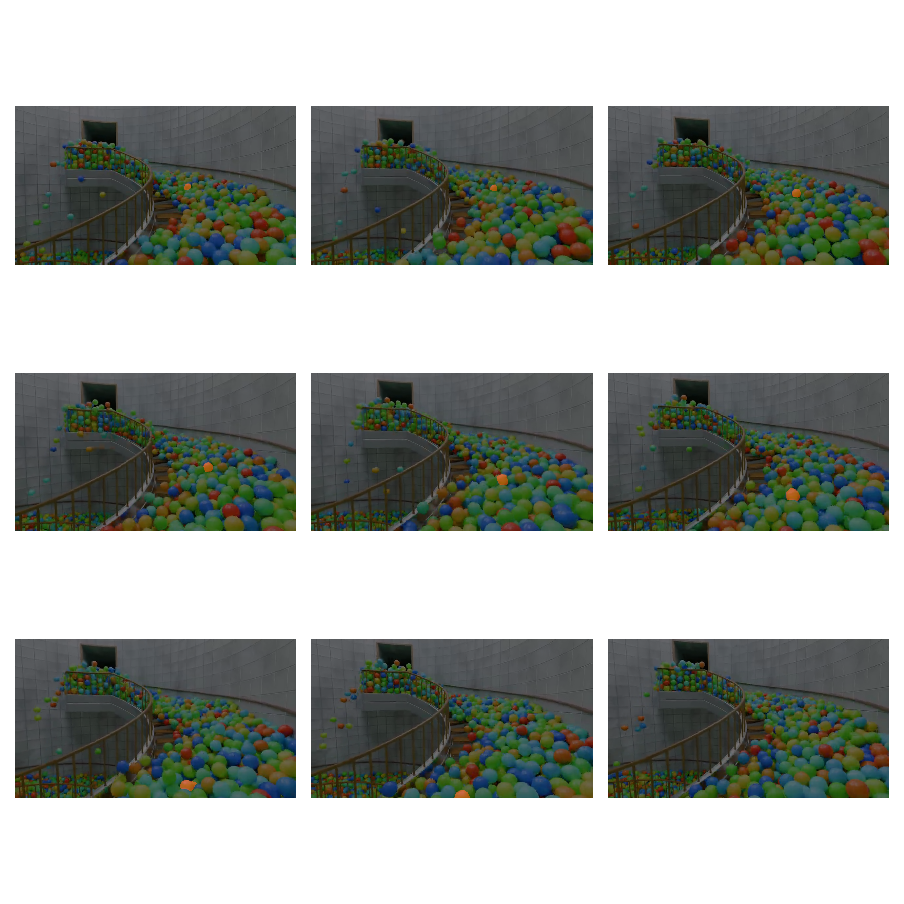
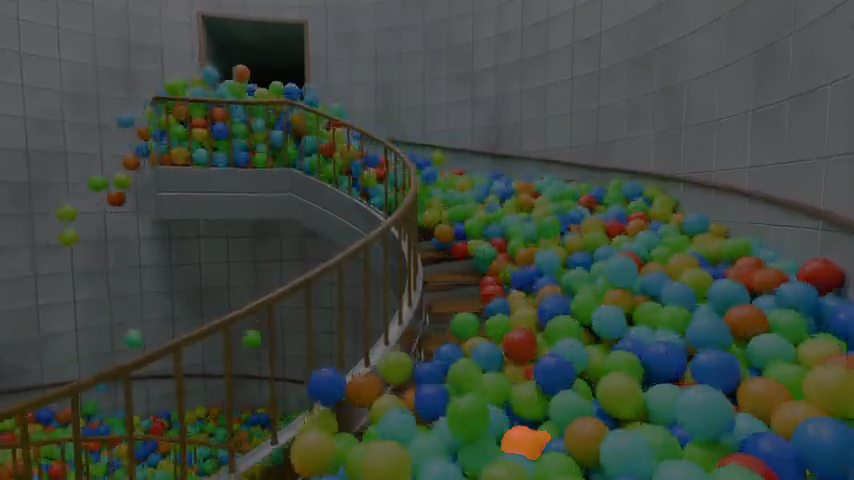
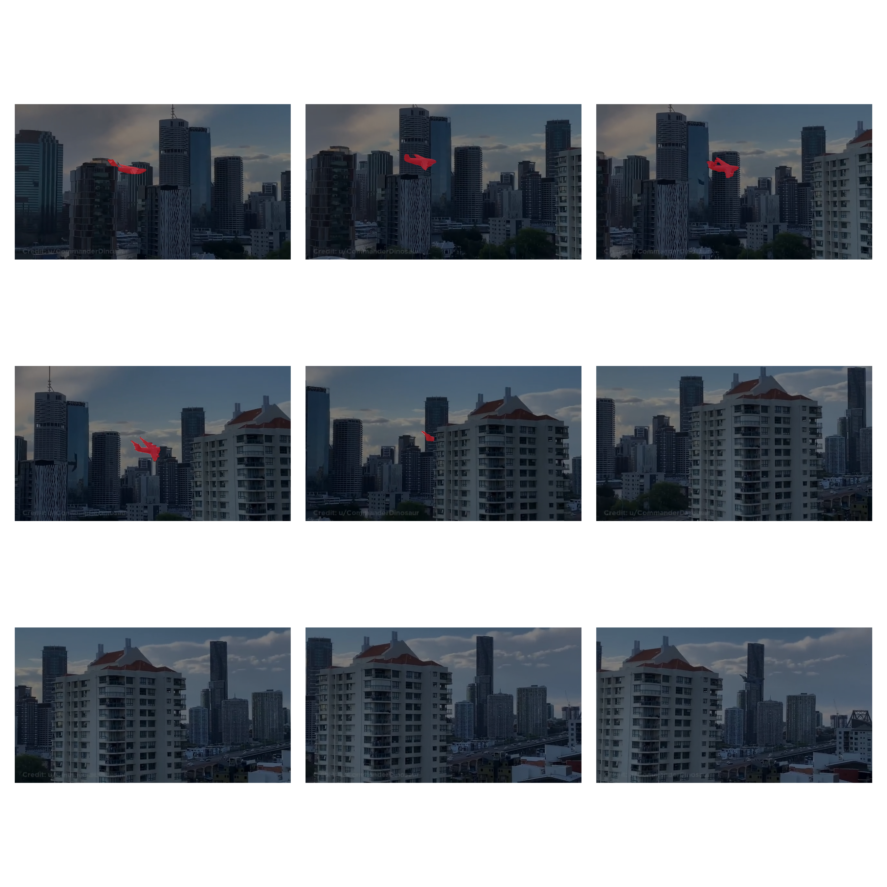

# EE243-Project

Video to overview: 

https://youtu.be/qKajuECrM-Y

## Experiment Results

### Baseline - DAVIS 2016

Before experimenting with more challenging scenarios, we first tested SAM2 on the [DAVIS 2016](https://davischallenge.org/davis2016/code.html) dataset to establish a qualitative baseline for performance. The DAVIS benchmark is common and provides high-quality ground-truth annotations on a large set of framsets, making this a suitable choice for validating the pipeline and behavior of SAM2. Specifically, we selected the "dog" sequence and initialized SAM2 using the first-frame object mask. The resulting segmentations help serve as a reference point for quality in the further experiments. 

Below are 9 frames, evenly spaces out across the 60-frame sequence, segmenting the dog from its scene: 


### Experiment 1 - Sensitivity to Initialization Noise

While SAM2 demonstrates strong performance when provided with an accurate first-frame mask, real-world annotations are often imperfect. To evaluate the robustness of SAM2 to initialization errors, we introduced noise into the first-frame object mask before performing tracking. This experiment investigates whether small inaccuracies in the initial segmentation propagate throughout the sequence and degrade tracking performance over time.

This experiment evaluates how sensitive the SAM2 image tracking model is to noise in the initial input mask. In this setup, an initial dog mask is provided to SAM2, but different levels of noise are applied to that mask before it is used as the starting point for tracking across the image sequence. The purpose is to observe how errors in the initial mask affect the models ability to continue tracking and segmenting the dog in later frames.

At a noise level of 0.05, the added noise has little to no visible effect on tracking performance. SAM2 is still able to correctly track the dog across the frames, and the predicted masks remain close to the true object shape. At 0.10 noise, the results are still strong. There may be slight mask imperfections, but the model continues to identify and follow the dog successfully throughout the sequence.

At 0.25 noise, the model is still stable, The dog is still detected in most frames, which suggests that the model can tolerate a moderate amount of noise in the initial mask while still maintaining object tracking.

At 0.50 noise, the model performance drops significantly. SAM2 appears to produce a usable result for the first mask but then fails to continue tracking the dog reliably in the following frames. This suggests that once the initial mask becomes too noisy, the model may lose a stable representation of the target object. Instead of recovering the full dog shape and the tracking process breaks down early!

At 0.75 noise, SAM2 no longer tracks the full dog. Instead, it only highlights small regions of the dog, mostly around the upper back and shoulder area. This indicates that the noisy initial mask no longer provides enough accurate object information for the model to understand the complete target. At 0.90 noise, the model essentially fails and does not produce a meaningful segmentation of the dog.

Overall, the results show that SAM2 is fairly robust when the initial mask contains low levels of noise, such as 0.05 and 0.10 and .25. However, performance degrades sharply between 0.25 and 0.50 noise. Once the initial mask becomes too noisy, SAM2 loses the ability to track the object consistently across frames. This shows that the quality of the initial mask is important for reliable SAM2 image tracking, especially because errors in the first mask can propagate through the rest of the sequence, as mentioned above.


### Experiment 1 Results: 

SAM2 With Noise Mask (.05)


SAM2 With Noise Mask (.10)


SAM2 With Noise Mask (.25)



SAM2 With Noise Mask (.50)



SAM2 With Noise Mask (.75)



SAM2 With Noise Mask (.90)



### Experiment 2 - Sensitivity to Similar-Looking Objects

The TED paper specifically argues that tracking visually similar objects is a challenging setting for many tracking methods, since appearance cues alone may be insufficient to maintain object identity. Although SAM2 performs strongly on video object segmentation tasks, we wanted to test how consistent it performs when the target object is surrounded by many visually similar distractors. This experiment stress-tests SAM2’s ability to preserve object identity when the scene contains multiple objects with nearly identical color, shape, and texture.

This experiment, along with experiment 3, required us to obtain our own training data, and convert it into an acceptable set for SAM2 to use. To do this, we downloaded [this video](https://youtu.be/psczv5XkcKg?si=g4LhWLARkb5mahUV) off of Youtube, and ran `extract_frames.py` to extract 60 frames across a selected clip of the original video (since usually, the entire video was too much context for our purposes). Then, we used [CVAT](https://www.cvat.ai/) to manually annotate the target object in the first frame, producing a segmentation mask that served as the initialization mask for SAM2. The resulting frame sequence and mask were then used as input to the tracking pipeline.

For this experiment, we selected a green ball as the target object because green balls appeared to be the most common in the scene, making them the most likely candidates for identity confusion. Across the 60-frame sequence, SAM2 generally performs well, successfully maintaining the target object's identity despite the presence of numerous visually similar distractor objects (seen in the 9-frame summary grid below). However, upon closer inspection, there are several frames in which the segmentation mask slightly leaks into neighboring green balls that are in close proximity to the target. While these instances are relatively infrequent and do not significantly affect long-term tracking performance, they reveal a minor sensitivity to densely packed scenes containing multiple similar-looking objects.

### Experiment 2 Results: 

(target object is "orange")



### Example Failure Case



### Experiment 3 - Sensitivity to Occlusion

In real videos, target objects are often partially or fully occluded by other objects. To evaluate SAM2 under this condition, we tested a sequence where the target object becomes temporarily hidden and later reappears. Several of the challenging examples presented by Zhang et al. involve visually similar objects interacting and partially occluding one another. In these scenarios, TED is able to maintain object identity by utilizing motion representations learned from video diffusion models. Motivated by these results, we test how well SAM2 handles a related challenge in which the target object becomes temporarily occluded before reappearing.

Credit to this video is from [u/CommanderDinosaur](https://www.reddit.com/r/brisbane/comments/dacgo9/big_rig/) on Reddit, and same preprocessing steps were taken. 

The video we chose for this experiment is a viral clip of a large big rig plane flying between multiple high-rises in a city landscape. Near the end of the video, the plane is fully occluded by one of the buildings before reappearing on the opposite side while maintaining a consistent trajectory and apparent speed. SAM2 successfully tracked and segmented the plane as it approached the occlusion, demonstrating strong performance while the target remained visible. However, after the plane re-emerged from behind the building, SAM2 failed to reacquire and segment the target for the remainder of the sequence. This result suggests that prolonged complete occlusions can present a challenge for the model, causing it to lose track of the target object and fail to recover once visibility is restored. 

### Experiment 3 Results: 



## To run experiments

#### 1. Clone this repository

```bash
git clone https://github.com/addyhana/EE243-Project.git
cd EE243-Project
```

#### 2. Clone the official SAM2 repository

From the base directory (`EE243-Project/`):

```bash
git clone https://github.com/facebookresearch/sam2.git
```

#### 3. Create and activate a Python environment

Using Conda:

```bash
conda create -n sam2 python=3.10 -y
conda activate sam2
```

#### 4. Install PyTorch

Install the version appropriate for your system and CUDA version. For example:

```bash
pip install torch torchvision
```

For CUDA-enabled systems, see the official PyTorch installation instructions:
https://pytorch.org/get-started/locally/

#### 5. Install SAM2

```bash
cd sam2
pip install -e .
```

If CUDA is available, install the optional CUDA extensions:

```bash
pip install -e ".[notebooks]"
```

After installing SAM2, download the model checkpoints:

```bash
cd checkpoints
./download_ckpts.sh
```

This will download the official SAM2 checkpoints, including:

```text
sam2.1_hiera_tiny.pt
sam2.1_hiera_small.pt
sam2.1_hiera_base_plus.pt
sam2.1_hiera_large.pt
```

#### 6. Install project dependencies

Return to the project root directory:

```bash
cd ..
```

Install the required packages:

```bash
pip install -r requirements.txt
```

#### 7. Run experiments

If running locally, example run: 

```bash
python run_sam2_baseline.py \
  --video_dir experiments/input_frames \
  --first_mask experiments/input_first_mask/first_mask.png \
  --output_dir results/dog_baseline
```

If running on UCR GPU cluster, submit the appropriate SLURM job script while inside the project directory. Refer to `.env_example` for the required environment setup and configuration to ensure scripts have correct accesses:

```bash
cd EE243-Project
sbatch experiments/jobs/run_sam2_[baseline/exp1/exp2/exp3].slurm
```

Generated masks and overlays will be saved to:

```text
results/[experiment#]/
```
